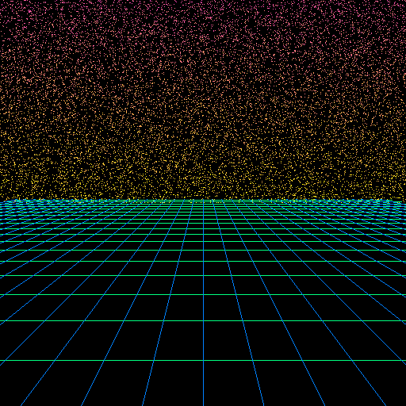
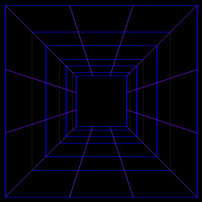
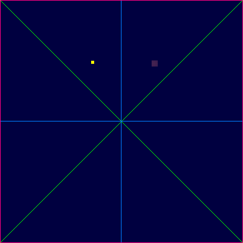
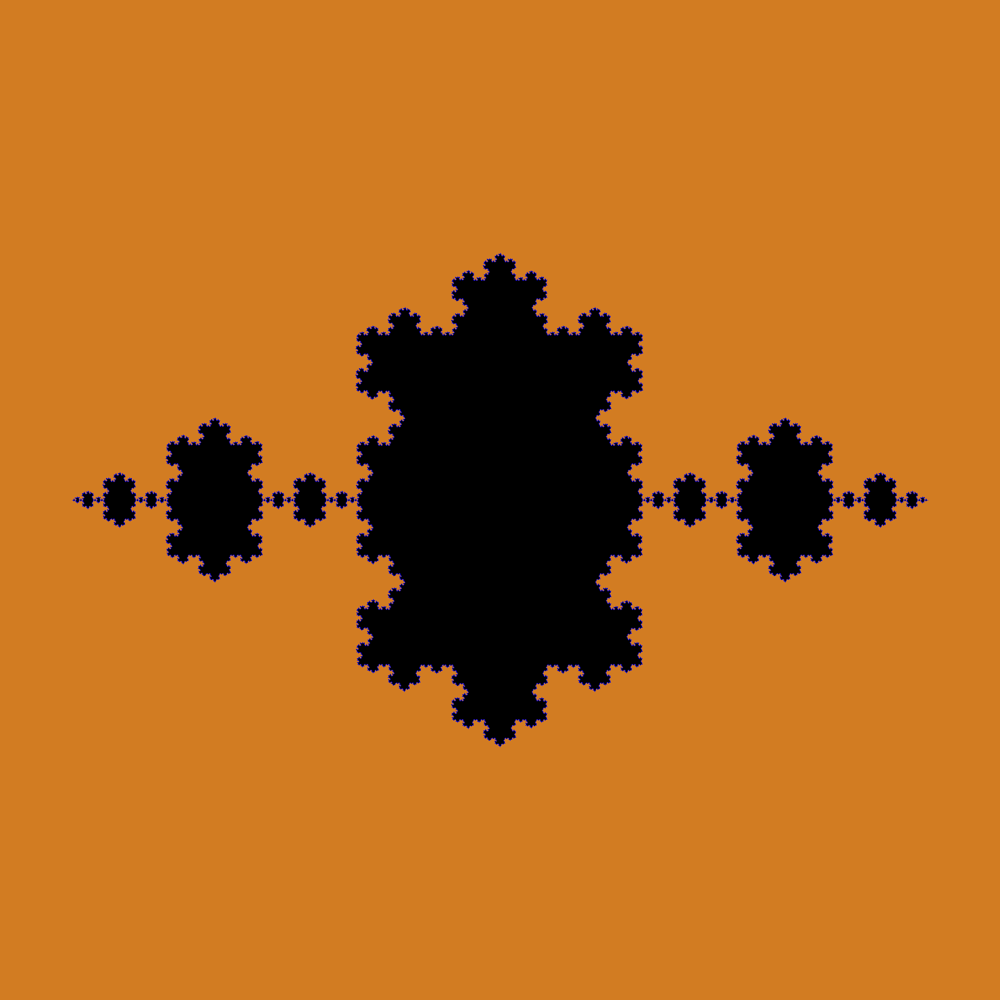
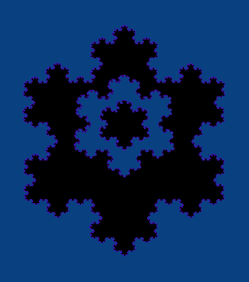
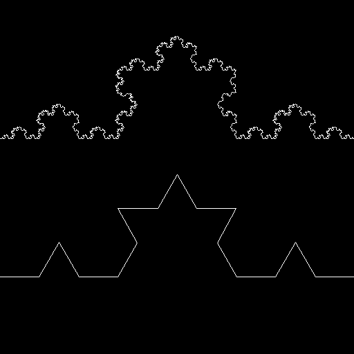

# Introdução à Análise de Algoritmos - Exercício Programa 1
Progama que desenvolve imagens digitais atráves de algoritmos recursivos na linguagem Java.

     

## Como Usar

**Observação**: é necessário ter o Java instalado para a execução e compilação do programa.

1. Descompacte em uma pasta os arquivos dentro do `.zip`
   
2. Crie um arquivo de entrada no formato `.txt` com os comandos e seus respectivos paramêtros. Há exemplos de entradas na pasta `entradas` e na seção [Comandos e Paramêtros](#comandos-e-paramêtros) estão listados todos os comandos e paramêtros disponíveis.
   
3. Compile a classe Main com o comando: 
   ```cli
    javac Main.java
   ```

4. Execute o comando com o nome de sua entrada `.txt` e o nome do arquivo `.png` que será criado:
   ```cli
    java Main entrada.txt saida.png
   ```
   Por conta da natureza da linguagem Java algumas entradas podem estourar o limite de memória (sobretudo as que utilizam o comando `REGION_FILL`). Portanto para rodar alguns casos é necessário aumentar a memória utilizada pelo Java, usando, por exemplo, o comando:
   ```cli
    java -Xss250M Main entrada.txt saida.png
   ``` 

## Como Funciona

### Classe Image

### Comandos e Paramêtros
`SET_COLOR`, `SET_PIXEL`, `DRAW_LINE`, `KOCH_CURVE` ou `REGION_FILL`